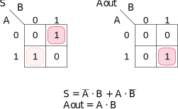

## Medio Sumador

Se conoce como medio sumador al circuito combinacional que permite realizar la operación se suma aritmética entre dos números binarios enteros *considerando solamente un acarreo de salida*.

### Entradas y salidas

El circuito posee dos posibles entradas:

-   $A$
-   $B$

Recordando que el número máximo de bit en la salida de un sumador es igual a $$
  \max\{nbit(A), nbit(B)\}+1
$$ Para este caso, el máximo número de bits entre $A$ y $B$ será 1 por lo que en la salida tendremos, a lo más, dos bits:

-   El resultado de la suma mediante la función $S$
-   El acarreo de salida mediante la función $A_{out}$

### Tabla de verdad

|  A  |  B  |  S  | $A_{out}$ |
|:---:|:---:|:---:|:----------:|
|  0  |  0  |  0  |     0      |
|  0  |  1  |  1  |     0      |
|  1  |  0  |  1  |     0      |
|  1  |  1  |  0  |     1      |

: Tabla de verdad para el circuito de medio sumador binario.

### Función booleana mediante minitérminos e implementación
\begin{aligned}
S(A, B) &=& \sum m(1,2)\\
        &=& m_1+m_2\\
        &=& \bar{A} B + A \bar{B}\\
\end{aligned}

Esta última es equivalente a la puerta lógica XOR (Puerta or exclusiva)

$$
S(A, B) = A\oplus B
$$

La salida $A_{out$ para el acarreo de salida será
\begin{aligned}
   A_{out} &=& AB\\
\end{aligned}

### Función booleana mediante maxitérminos e implementación
\begin{aligned}
S(A, B) &=& \prod M(0,3)\\
        &=& M_0\cdot M_3\\
        &=& (A+B)⋅(\bar{A}+\bar{B})\\
\end{aligned}

La salida $A_{out}$ para el acarreo de salida será
\begin{aligned}
   A_{out} &=& \prod M(0,1,2)\\
           &=& M_1\cdot M_2 \cdot M_3\\
           &=& (A+B)(A+\bar{B})(\bar{A}+B)\\
           &=& (A+B)(A\bar{A}+AB+\bar{A}\bar{B}+B\bar{B})\\ 
           &=& (A+B)(AB+\bar{A}\bar{B})\\ 
           &=& AAB+A\bar{A}\bar{B}+ABB+\bar{A}B\bar{B}\\ 
           &=& AB+AB\\ 
           &=& AB\\ 
\end{aligned}


### Función booleana mediante k-map
```{r, echo=FALSE, fig.align='center', fig.cap="Mapas de Karnaugh para el circuto de medio sumador binario", out.width="50%"}

```


TODO:

- Circuito equivalentes

