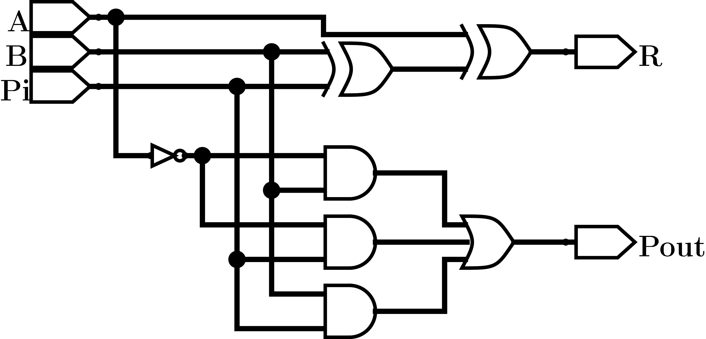
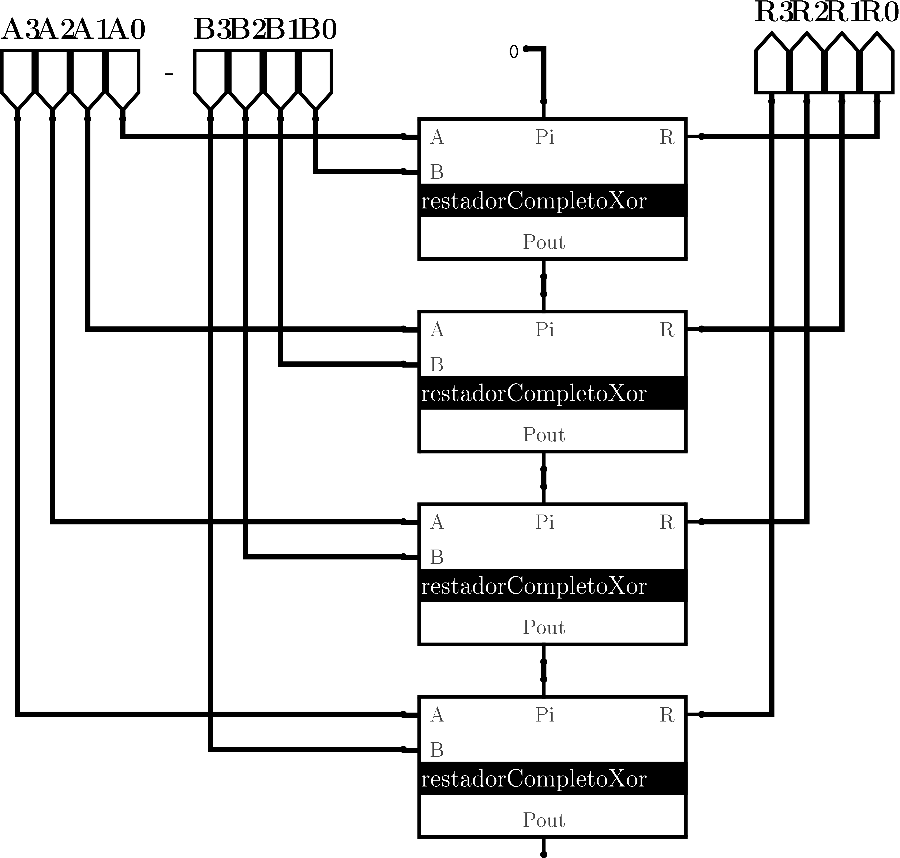

## Restador completo
Al igual que el sumador completo, el restador completo considera un 3er bit de entrada (prestamo de entrada) que permite extender este circuito hasta n-conexiones.

La tabla de verdad para este circuito por lo tanto considera tres entradas:

- $A$
- $B$
- $P_{in}$

Y dos salidas

- $R$
- $P_{out}$

```{r , echo=F}
library(kableExtra)
A <- c(0,0,0,0,1,1,1,1)
B <- c(0,0,1,1,0,0,1,1)
Pin <- c(0,1,0,1,0,1,0,1)
Pout <- c(0,1,1,1,0,0,0,1)
R <- c(0,1,1,0,1,0,0,1)

header <- c("Entrada"=3, "Salida"=2)

tabla <- data.frame(A,B,Pin,Pout,R)

kable(tabla) %>% 
  kable_styling("striped", full_width = F) %>%
  add_header_above(header)
```

### Circuito
```{r, echo=FALSE, fig.align='center', fig.cap="Circuito del restador completo utilizando puertas xor", out.width="60%"}

```

### Conexión en cascada
Utilizando el circuito de restador completo de 1 bits podemos extender el circuito a un restador de n-bits conectando en cascada n circuitos restadores de 1 bits. Por ejemplo, utilizando 4 circuitos restadores completos de 1 bits conectando las salidas de prestamo a las entradas de préstamo del siguiente circuito como:

```{r, echo=FALSE, fig.align='center', fig.cap="Circuito restador de 4 bits utilizando 4 circuitos restadores completos de 1 bits en conexion cascada.", out.width="60%"}

```


