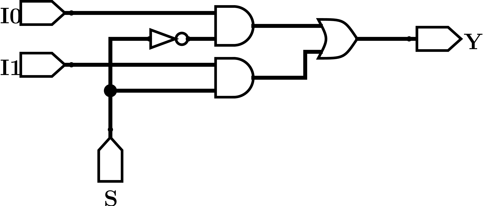
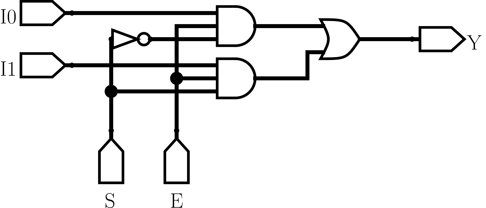

## Multiplexor (MUX)
El circuito Multiplexor tiene como finalidad conectar **una de las multiples entradas** del circuito a la salida $Y$, en otras palabras, los Multiplexores son switches digitales. La elección de que linea de entrada será conectada con la salida del circuito es realizada mediante unas entradas llamadas "lineas de selección". Normalmente, los MUX poseen $2^n$ lineas de entrada y $n$ lineas de selección. Las entradas de selección utilizan la numeración binaria para seleccionar la entrada a conectar.


```{r , echo=F, warning=FALSE}
library(kableExtra)
I0 <- c(0,0,0,0,1,1,1,1)
I1 <- c(0,0,1,1,0,0,1,1)
S <- c(0,1,0,1,0,1,0,1)
Y <- c(0,0,0,1,1,0,1,1)


header <- c("Entrada"=3, "Salida"=1)

tabla <- data.frame(I0, I1, S, Y)

kable(tabla) %>% 
  kable_styling("striped", full_width = F) %>%
  add_header_above(header)
```

\begin{aligned}
  Y &=& \bar{I_0}I_1 S + I_0\bar{I_1}\bar{S}+I_0I_1\bar{S}+I_0I_1S\\
    &=& I_1S(I_0\bar{I_0})+I_0\bar{S}(I_1\bar{I_1})\\
    &=& I_1S+I_0\bar{S}\\
\end{aligned}

```{r mux1bit, echo=FALSE, fig.align='center', fig.cap="Circuito Multiplexor de 1 bit.", out.width="60%"}

```

> TODO:

> - Agregar símbolo equivalente

### Implementación de entrada habilitante
Una de las extensión más interesantes de este circuito combinacional es la adición de una entrada habilitante, generalmente denominada como entrada $E$ (enable) que permite activar/desactivar el MUX. Una forma de implementar esta entrada sería realizar el procedimiento típico de diseñar una tabla de verdad, ahora con 4 entradas, encontrar la función booleana e implementar el circuito, pero existe otra forma más intuitiva que veremos a continuación.

Consideremos el circuito de la figura \@ref(fig:mux1bit), vemos que tanto la entrada $I_0$ como la entrada $I_1$ se encuentran conectadas a dos puertas AND antes de ser sumadas mediante la puerta final OR. En general, las puertas AND (como su nombre lo indican) pueden ser utilizadas como puertas habilitantes ya que, si una de sus entradas es cero, entonces si salida siempre será cero, independiente de los otros valores de entrada en la puerta. De esta forma, si ampliamos el número de entradas en cada una de las puertas AND de 2 a 3 podemos utilizar esta nueva entrada para habilitar/deshabilitar el circuito globalmente. En la figura \@ref(fig:mux1bitE)

```{r mux1bitE, echo=FALSE, fig.align='center', fig.cap="Circuito MUX de 1 bit con entrada habilitante", out.width="60%"}

```


